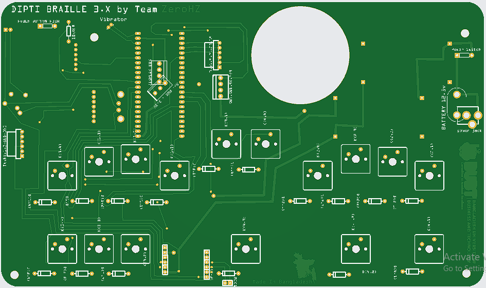
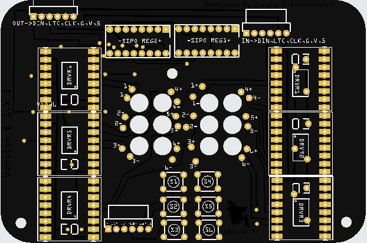

># DiptiBraille  

DiptiBraille is an affordable keyboard designed for the visually impaired, enabling text input using Braille. It supports document writing, reading, and audio playback for audiobooks. Users can connect an external Braille display for enhanced feedback.Wireless options include WiFi and WebShare for easy data transfer. Essential communication features like call and SMS are included for seamless interaction.

># Operating System
DiptiOS/3 is a pioneering operating system meticulously crafted to cater to the unique needs of braille users. Rooted in the robust framework of [FreeRTOS](https://www.freertos.org/RTOS.html), DiptiOS/3 sets a new standard for accessibility, seamlessly integrating with braille display hardware to deliver unparalleled functionality and ease of use.

Experience the sophistication of DiptiBraille's sleek design and intuitive interface, offering both Demo and Pro versions. <b><i>Unlock the full potential with the Pro Version, priced at $39</i></b>, or explore its capabilities at no cost with the Demo Version.

|✅ available|❌ not available|🔄 upcoming|🟡 partially available|
|------------|-----------------|-----------|-----------------------|

| Features           | Pro| Demo | Features           | Pro|Demo |  Features          | Pro|Demo |
|-------------------------|-----|--------|--------------------|-----|--------|-------------------------|--------|------|
| 📄 Doc Writing | ✅ |✅ |🖋️ Practice Writing | ✅|❌| 📚 Learn Writing| ✅ |🟡|
|📜 Doc Reading | ✅|✅ | 📖 Practice Reading|  ✅ |❌|📘 Learn Reading| ✅ |🟡|
|🎧 Audio Book |✅|✅ |🎵  Music Library  | 🔄 |❌   | 📞 Call|✅|🟡|
|💬 SMS |✅|❌| 🧮 Calculator | ✅|🟡 |⌨️ BLE KeyBoard| 🔄 |❌|
|Bluetooth|✅| ❌ |  WebShare| ✅ |❌|  RemoteShell|🔄| ❌ |
| WiFi Manager| ✅|🟡 |⬇️ Download Manager |  ✅|❌ |📱 Phone Manager| ✅ |❌|
|⚡Continuous Updates |  ✅ |🟡|
### DiptiOS/3 Ensures
| OS Feature                      | Description                                                                                               |
|------------------------------|-----------------------------------------------------------------------------------------------------------|
| Optimized Braille Support   | Comprehensive support for braille display devices ensures smooth input and output.                        |
| Intuitive Interface         | User-friendly interface tailored for braille users prioritizes ease of navigation.                          |
| Real-Time Responsiveness    | Built on FreeRTOS for instant feedback and interaction.                                                    |
| Customization Options       | Personalize braille experience with customizable settings.                                                  |
| Seamless Connectivity       | Effortless data exchange with other devices and platforms.                                                  |
| Enhanced Accessibility     | Enjoy voice feedback and screen magnification.                                                             |
| Reliability and Stability  | Backed by FreeRTOS for consistent performance and uptime.                                                   |

># Hardware
### Printed Circuit Boards
|**Base Material:** FR-4|**Layers:** 2|**Thickness:** 1.6 mm|**Surface:** HASL(with lead)|**Quality:** IPC 2|**Silkscreen:** White|
|-----------------------|-------------|---------------------|----------------------------|------------------|---------------------|

| Main Unit PCB Outlook | Additional Info | **Display Unit PCB Outlook**  | **Additional Info** |
|---------------------------|---------------------------------------------------------|---------------------------|---------------------------------------------------------|
|  |**Price:** $13  **Dim:** 251x148  **Color:** Green  |  | **Price:** $7 **Dim:** 116x77  **Color:** Black |

### 🔧 Components List
| Component                           | Quantity | Component                           | Quantity |
|-------------------------------------|----------|-------------------------------------|----------|
| 💻 ESP32 S3 N16R8                   | x1       | 📶 SIM800L GSM module               | x1       |
| ⌨️ Cherry MX Mechanical keys        | x16      | ⌨️ Mechanical Key Cap               | x16      |
| 🔊 I2S Amplifier                    | x1       | 🔊 Speaker 3W                       | x1       |
| 📇 SD Card Module                   | x1       | 📇 SD Card                          | x1       |
| ⚙️ Motor Driver - TB6612FNG         | x6       | 🔄 Shift Register - 74HC595         | x2       |
| 🔋 4.2v 2000mAh Li-on Battery       | x3       | ⚡ BMS (Circuit Protector)          | x1       |
| ⚡ 5V Constant Step Down BUCK Converter | x2    | 🔌 12v Laptop Charger               | x1       |
| ⚡ Capacitor                        | x2       | ⚡ Diode                            | x20      |
| 🔘 Push Button                      | x10      |                                     |          |
# Acknowledgements
- [Rakib Hasan](https://github.com/TheZeroHz): The initiator DiptiBraille,expertise in hardware design, development of crucial libraries, handling multicore aspects, and algorithm design has laid the foundation for the project's success.

- [Sudipa Saha](https://github.com/Sudipa45): Sudipa's significant contributions in designing crucial algorithms, along with her unwavering support and proficiency in merging code, have played a pivotal role in shaping the project's development and direction.

- [Mahareen Afroj](https://github.com/maharinafroj): Mahareen's instrumental role in communication and outreach efforts has been invaluable, fostering connections critical to the project's outreach.
- [BUBT](https://www.bubt.edu.bd/): The Bangladesh University of Business and Technology (BUBT) has provided essential financial support through its Student Fund, enabling the realization of Dipti Braille. This support underscores BUBT's commitment to fostering innovation and accessibility in education and technology.We extend our sincere gratitude to BUBT

- [Md. Saifur Rahman](https://www.bubt.edu.bd/department/member_details/80) (Chairman of BUBT) and [Dr. Muhammad Fayyaz Khan](https://eee.bubt.edu.bd/faculty-members/dr-muhammad-fayyaz-khan) (Vice-Chancellor of BUBT): Their steadfast moral support have been the cornerstone of DiptiBraille's journey, ensuring its realization and impact.

# External Libraries We have Used
- [gpio_viewer](https://github.com/thelastoutpostworkshop/gpio_viewer) by [charlesgiguere](https://github.com/charlesgiguere)
- [ESP32-audioI2S](https://github.com/schreibfaul1/ESP32-audioI2S) by [schreibfaul1](https://github.com/schreibfaul1)
- [ESPFMfGK](https://github.com/holgerlembke/ESPFMfGK) by [Holger Lembke](https://github.com/holgerlembke)
- [WebSerialLite](https://github.com/asjdf/WebSerialLite) by [杨成锴](https://github.com/asjdf)
- [WifiManager](https://github.com/tzapu/WiFiManager) by [tzapu](https://github.com/tzapu)
- [Keypad](https://github.com/Chris--A/Keypad) by [Christopher Andrews](https://github.com/Chris--A)
- [ESPAsyncTCP](https://github.com/me-no-dev/ESPAsyncTCP) by [Me No Dev](https://github.com/me-no-dev)
- [ESPAsyncWebServer](https://github.com/me-no-dev/ESPAsyncWebServer) by [Me No Dev](https://github.com/me-no-dev)
- [ESP32-BLE-Keyboard](https://github.com/T-vK/ESP32-BLE-Keyboard) by [T-vK](https://github.com/T-vK)

  We express our gratitude❤️ to these developers for their remarkable libraries.

